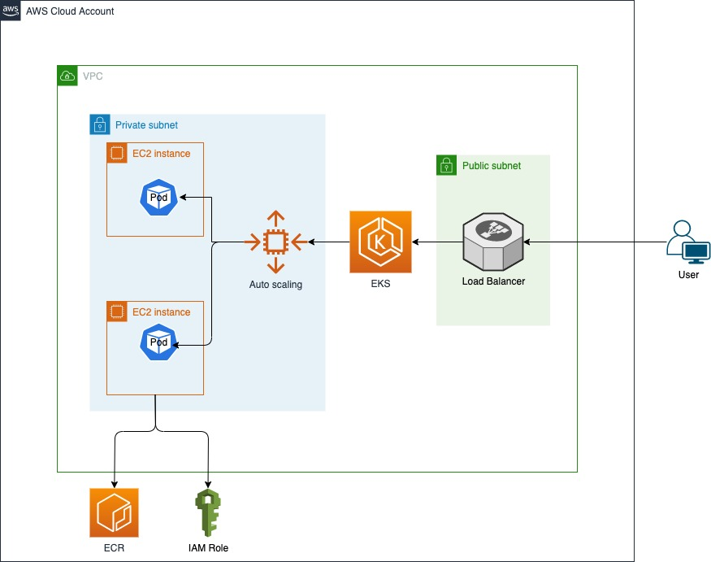

# Python Static Website with Kubernetes



Steps to deploy:

- Deploy the Terraform code under terraform folder which will create EKS Cluster with VPC and ECR.
- Build the docker image and push it into ECR. 
  - Authenticate to AWS ECR using the command
    ``` aws ecr get-login-password --region us-east-1 | docker login --username AWS --password-stdin 165387667510.dkr.ecr.us-east-1.amazonaws.com ```
  - Build the image using the command
    ``` docker build -t webapp . ```
  - Tag the image
    ``` docker tag webapp:latest aws_account.dkr.ecr.us-east-1.amazonaws.com/webapp:latest ```
  - Push the image to ECR
    ``` docker push aws_account.dkr.ecr.us-east-1.amazonaws.com/webapp:latest ```
- Create Kube config file using AWS CLI. Run the below command
  ``` aws eks --region <region-code> update-kubeconfig --name <cluster_name> --role-arn <role_arn>```
- Update the image name in deployment.yaml file with the ECR url.
- Setup secrets by running the command. Secret values are base 64 encoded and stored in it. 
  ``` kubectl apply -f mysecret.yaml ```
- Deploy pods by running the command.
  ``` kubectl apply -f deployment.yaml ```
- Check the Pod status by running ``` kubectl get pods ```
- Access the website using the ELB URL by running the command. This will display the external IP of the ELB and it can be accessed as <elburl>:5005
  ``` kubectl get svc ```
- If the site has to be accessed from local. It can be achieved through port forwarding with below command. Once it is run, the site can be accessed as localhost:5001
  ``` kubectl port-forward svc/<servicename> 5005:5001 ```
